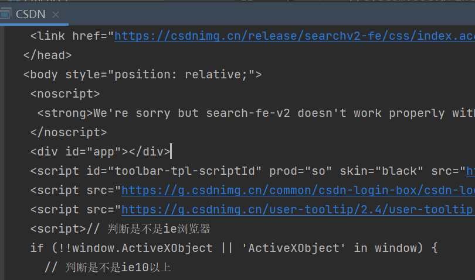
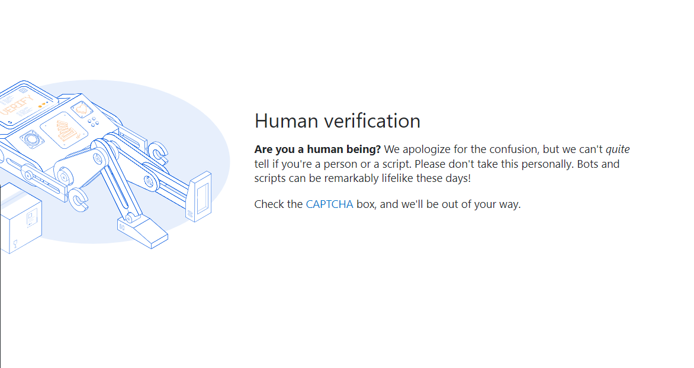
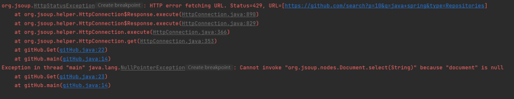
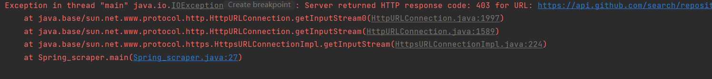

# Java Framework Overdose

## 1 整体介绍

### 1.1 主题

信息化世界的技术总是瞬息万变。作为学习者，我们总得时刻提醒自己注意周边环境的变化：我们正在学的技术是否已经过时？我们正在用的框架是否已经有了更优化的版本？在茫茫的技术海洋中，有哪些才是真正有价值的，值得我们用心领悟的？

基于以上考量，我们试着瞄准 Java 开发框架进行了一次探究。为了分析一项技术的生命力，我们试着从开源社区入手，希望通过考察其被用来进行创造的活跃度、以及人们对相关产品的关注度，来实现我们的最终分析。

于是，本项目针对近年来在 Java 开发中较为流行的框架，通过爬取开源网站 Github 上的相关仓库信息（仓库stars数量、forks数量、各时间段仓库创建数等），对各个框架在社区中的流行度与活跃度进行了分析比较。经由数据库进行存储和筛选，本项目以多样化的图表的形式呈现了数据分析结果，并提供将各个框架的开源仓库整合在一起的数据库图形接口，以便用户进行整体浏览。

### 1.2 框架内容

本项目中涉及分析到框架包含以下三类十三种：

Web Application Framework

- **Spring**: Enterprise-level Java application framework
- **Struts**: another MVC framework for enterprise-level Java applications
- **Apache Spark**: Micro framework for web apps and REST APIs
- **GWT(Google Web Toolkit)**: client-side Java apps deployed as JavaScript
- **Blade**:  Simple application framework with a minimal footprint
- **Vaadin**: Web application framework with a focus on UX, accessibility, and mobile
- **JHipster**: Web apps and microservices with Spring Boot and Angular/React

- **Tapestry**: Component-oriented framework for highly scalable apps
- **Wicket**: Component-based web application framework for purists

ORM or Database Manipulation Framework

- **Hibernate**: Object-relational mapping framework for a better database communication
- **MyBatis**: Persistence framework for easier SQL management

Web Services Framework

- **Dropwizard**: a high-performance but straightforward Java framework for rapid development of RESTful web services.


Reference: https://raygun.com/blog/popular-java-frameworks/


### 1.3 效果呈现

- 整体流行度表现：饼状图、词云
- 近十年活跃度表现：折线图、动态增长图

其中，流行度计算方式为 stars数 + forks数，活跃度表现考察方式为某一时间段中该框架相关仓库创建数量。


### 1.4 技术栈

- 前端: Vue, Cubism
- 后端: SpringMVC + Spring + MyBatis (with SpringBoot)
- 数据库: MariaDB (on Linux)
- 数据来源: https://api.github.com
- 爬虫与数据处理实现: Java

### 1.5 团队分工

- 12011411 吴笑丰：后端、数据库设计、数据处理、部分数据爬取
- 11911109 张倚凡：前端
- 12012428 沈徐檑：数据爬取

## 2 后端介绍

后端与爬虫作为 Java 项目的主体，整体使用了 Maven 进行项目管理。后端的具体实现上，采用了 SpringMVC + Spring + MyBatis 的 SSM 整体框架，分别对表现层、业务逻辑层、数据访问层进行了实现。

### 2.1 后端文件结构

```
.
├── controller
│   └── mainController.java
├── dao
│   └── GithubDao.java
├── pojo
│   └── Repo.java
├── sendData
│   ├── cloudData.java
│   ├── dynamicData.java
│   ├── lineChartData.java
│   ├── pieData.java
│   └── tableData.java
├── services
│   ├── GitHubService.java
│   └── impl
│       └── GitHubServiceImpl.java
└── SsmApplication.java
```

### 2.2 重要类、方法介绍

#### MainController

表现层的实现，在 SpringBoot 和 SpringMVC 的配合下表现得十分简洁。

```java
@CrossOrigin
@RestController
@RequestMapping("/data")
public class mainController {

  @Autowired
  private GitHubService gitHubService;

  @GetMapping("/line")
  public String getLineChart(){
    return gitHubService.sendLineChart();
  }
  @GetMapping("/table")
  public String getTable(){
    return gitHubService.sendTable();
  }

  @GetMapping("/pie")
  public String getPie(){
    return gitHubService.sendPie();
  }

  @GetMapping("/cloud")
  public String getCloud(){
    return gitHubService.sendCloud();
  }

  @GetMapping("/dynamic")
  public String getDynamic(){
    return gitHubService.sendDynamic();
  }
}
```

#### GitHuvService

业务层的接口，将通过 Dao 得到的数据进行业务处理，并返回给表现层。

```java
@Transactional
public interface GitHubService {
    public String sendLineChart();
    public String sendTable();
    public String sendCloud();
    public String sendDynamic();
    public String sendPie();
}
```

#### GithubDao

直接与数据库交互的数据层，采用了 MyBatis 的注解开发模式。

```java
@Mapper
public interface GithubDao {

    @Select("select * from github_repos")
    public List<Repo> getAllRepos();

    @Select("select * from github_repos where create_year=#{year} and frame_id=#{frame}")
    public List<Repo> getReposByYearAndFrame(Integer year, Integer frame);

    @Select("select * from github_repos where create_year=#{year} and create_month = #{month}" +
            " and frame_id=#{frame}")
    public List<Repo> getReposByTimeAndFrame(Integer year, Integer month, Integer frame);

    @Select("select * from github_repos where create_year=#{year} ")
    public List<Repo> getReposByYear(Integer year);

    @Select("select * from github_repos where frame_id=#{frame} ")
    public List<Repo> getRepoByFrame(Integer frmae);
}
```

## 3 数据库设计

图片

数据量级：

与爬虫的配合：

```java
public class DataBaseController {
    private DataSource dataSource;
    private int repoCnt = 0;
    private Map<String ,Integer> frameworkMap;

    //...
    
    public void insertRepo(JRepo repo) {
        try (Connection connec = dataSource.getConnection()) {

            String sql = "insert into github_repos (repo_name, full_name, url, stars, forks, create_year, create_month, updated_date, description, frame_id) " +
                    "values (?, ?, ?, ?, ?, ?, ?, ?, ?, ?)";

            PreparedStatement pstm = connec.prepareStatement(sql);
            pstm.setString(1, repo.getName());
            pstm.setString(2, repo.getFull_name());
            pstm.setString(3, repo.getHtml_url());
            pstm.setInt(4, repo.getStargazers_count());
            pstm.setInt(5, repo.getForks_count());
            String create_date = repo.getCreated_at();
            String update_date = repo.getUpdated_at();
            pstm.setInt(6, Integer.parseInt(dateConvert(create_date).substring(0,4)));
            pstm.setInt(7, Integer.parseInt(dateConvert(create_date).substring(5)));
            pstm.setString(8, dateConvert(update_date));
            String description = repo.getDescription();
            if (description != null && description.length() >= 100)
                description = description.substring(0,100);
            pstm.setString(9, description);
            pstm.setInt(10, frameworkMap.get(repo.getFramework()));

            pstm.execute();
            repoCnt++;
        } catch (SQLException throwables) {
            throwables.printStackTrace();
        }
    }
}

```

## 4 爬虫

利用 Github 提供的 REST API 进行了仓库的数据爬取。在使用时，发现简单的搜索语句只会呈现1000条搜索结果，于是利用了如下请求，采取调整时间的方式进行了更多搜索结果的爬取。

```
https://api.github.com/search/repositories?q=framework_name+language:java+created:>created_time&sort=created&order=asc&per_page=100&page=i
```

github search 访问限制：https://docs.github.com/en/rest/search#about-the-search-api

方法参考：https://stackoverflow.com/questions/37602893/github-search-limit-results

另外，对于大部分框架来说，使用关键词搜索（匹配仓库名、标签及描述）后的的仓库数量大致在10k条上下。但是对于 Spring 和 Spark 两者来说，他们与其他框架不在一个数量级上，前者的仓库数目在600k左右，后者在100k左右。考虑到爬取的时间，以及数据库的存储容量等问题，我们在爬取了两者的高stars数仓库后，对整体的数据量进行了控制。我们保证 Spring 仓库的数量不超过50k，Spark 的仓库量不超过20k。

```java
public class github_scraper {
    
    //...
  
  public void repoScrapeByTime(String framework) {

    int cnt = 0;
    int total_cnt = 1;
    int limit = (framework.equals("Spring") ? 50000: 20000);
    String created = "2012-01-01T00:00:00Z";
    String last = null;
    URL url = null;
    do {
      for (int i = 1; i <= 10; i++) {
        String s = String.format("https://api.github.com/search/repositories" +
                "?q=" + framework + "+language:java+created:>" + created +
                "&sort=created&order=asc&per_page=100&page=" + i);
        try {
          url = new URL(s);
          HttpURLConnection conn = (HttpURLConnection) url.openConnection();
          conn.setRequestMethod("GET");

          byte[] encodedAuth = Base64.encodeBase64(token.getBytes(StandardCharsets.UTF_8));
          String authHeaderValue = "Basic " + new String(encodedAuth);
          conn.setRequestProperty("Authorization", authHeaderValue);

          conn.connect();

          StringBuilder content = new StringBuilder("");
          BufferedReader bi = new BufferedReader(new InputStreamReader(conn.getInputStream()));
          String line = null;
          while ((line = bi.readLine()) != null) {
            content.append(line);
          }

          JsonObject result = JsonParser.parseString(content.toString()).getAsJsonObject();
          total_cnt = result.get("total_count").getAsInt();

          if (result.get("items").getAsJsonArray().size() == 0) {
            created = last;
            break;
          }
          for (JsonElement item : result.get("items").getAsJsonArray()) {
            JRepo repo = gson.fromJson(item, JRepo.class);
            repo.setFramework(framework);
            controller.insertRepo(repo);
            last = repo.getCreated_at();
            cnt++;
          }
          controller.printCnt();
          System.out.println("total: " + total_cnt + " cnt: " + cnt);
          System.out.println("next time: " + created );

        }catch(Exception e){
          e.printStackTrace();
        }
      }
      // scrap by time
      if (framework.equals("Spring")) created = timeAdd(created, 1);
      if (framework.equals("Spark")) created = timeAdd(created, 2);
    } while( (cnt < limit) && (timeCheck(created)));
  }
}
```

### 旧思路

原本的打算是分别挖掘CSDN、知乎、GitHub和Stack Overflow等平台的关于Java Spring的相关数据。可是遇到了jsoup无法执行JavaScript，我们所访问的网页并不包含我们所需要的div数据，所以CSDN和知乎的数据无法爬取。



可以看到这里的document中不存在想要的#app的子元素。
另一方面，stack overflow有着captcha（全自动区分计算机和人类的图林测试），脚本依然无法访问。



所以，我们爬取了再GitHub上的关于Java Spring的相关数据。在GitHub主页搜索“Java Spring”词条，可以搜索到100页每页10份的相关结果。我们爬取这些搜索结果的被浏览量和最后更新日期，从而得到1000份相关数据。
由于有100页的搜索结果，爬取过程需要访问近似网页100次。为了保证爬虫的礼貌性，我们设置了每次访问后100毫秒的延迟时间。但是这在访问第十次网页的时候还是跳出了HTTP 429的请求过多错误。



发现短时间内只能连续访问九次，所以我们又让脚本在每访问九次之后做一个10000毫秒的延迟，也就是十秒。发现还是无法第十次访问网页。所以我们将延迟扩大至60秒，发现能够正常运行，直至第四十六次访问网页，再一次跳出了HTTP 429的错误。为了能够稳定获取数据，我们最后将延迟时间调整至120秒即120000毫秒之后，脚本方能正常运行，得到1000条目标数据。整个脚本运行时间大概在23分钟左右。

我们分别爬取了在GitHub上搜索词条“Java Spring”、“Spring boot”、“Spring MVC”、“Spring Cloud”、“Spring Data”、“Spring Security”和“Spring Batch”。每个词条分别获取1000条相关数据，来存入后端的数据库。

之后，我们尝试通过GET的请求方法，可以一次获取所有的网页信息。并通过设置per_page=100(最多为100)，让我们可以在一次访问中获取100条目标信息。相比之前的每次访问中获取10条数据，效率提高了很多。但是该方法在短时间内多次对网页进行访问，还是会有HTTP 403禁止访问的报错现象。



获取的所有数据通过Json格式传输至数据库。

## 5 Frontend

前端搭建使用Vue框架，将使用该框架打包的网页资源放在IIS服务器上，再进行内网穿透，可以在浏览器上
直接使用公网访问该网页，不需要再运行vue项目。

网页的交互方式，部分图片资源和全部音乐资源参考自游戏《主播女孩中毒依赖》。Live2d看板娘包括
自主创作的人物Histoire，参考自游戏《超次元游戏海王星：重生3》，包含呼吸和盯鼠标动作；以及官方
SDK提供的样例人物模型。

所有图表的制作使用了echart的API和脚本资源。

